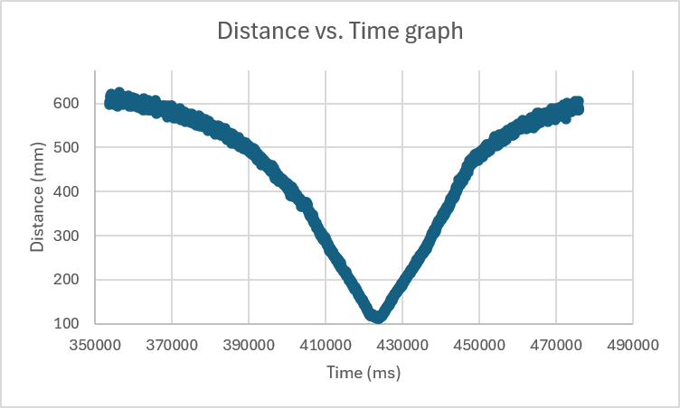
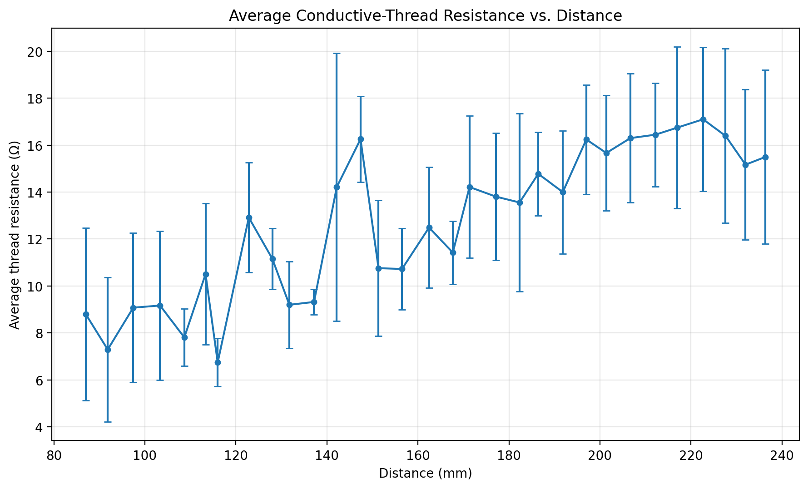
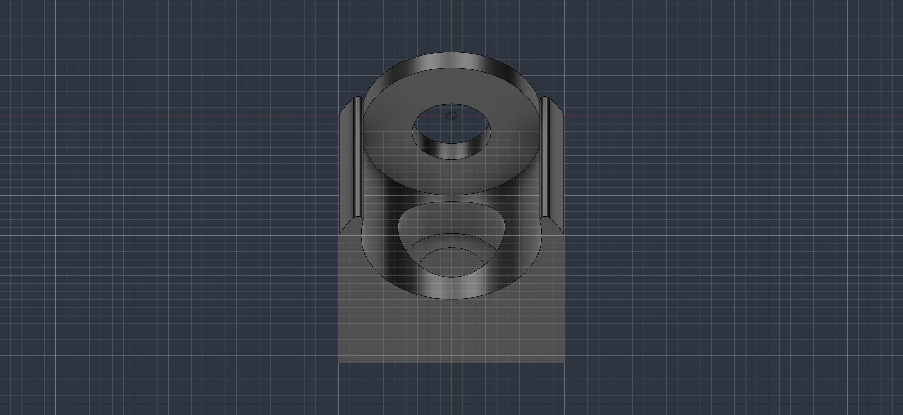
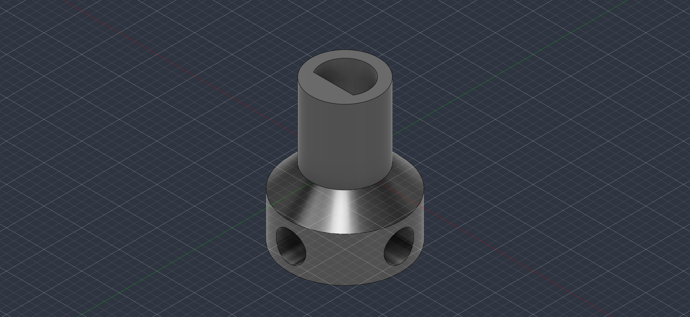
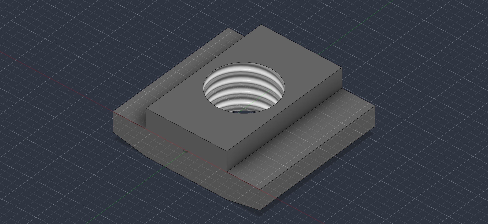

# Twisted String Actuator Test Apparatus
A mechatronics test platform designed to characterize the relationship between
actuator contraction and the electrical resistance of conductive thread in a
twisted string actuator (TSA).

The system combines mechanical actuation, position sensing, electrical
resistance measurement, embedded control, and automated data logging.

## Project Overview

The system uses a DC motor to twist the string while an Arduino simultaneously
records actuator position and electrical resistance. The resulting data can be
used to investigate whether the conductive string itself can provide useful
position feedback for a soft/wearable robotic actuator.

## Demonstration

**Click the image to view the demonstration video.**

## Experimental Results

### Actuator Position vs. Time

The time-of-flight sensor tracks the position of the moving carriage throughout
actuation, allowing the contraction of the twisted string actuator to be
measured over time.

### Position vs. Electrical Resistance

The conductive string forms part of a voltage-divider circuit, allowing its
electrical resistance to be estimated continuously during actuation. Position
and resistance measurements were recorded simultaneously to investigate the
relationship between actuator contraction and electrical resistance.

## CAD (Fusion 360) Designs

### Motor mount

### Motor attachment

### T-nut

## System Architecture

The apparatus integrates:

- Arduino Uno for control and data acquisition
- TB6612FNG motor driver
- DC motor for twisting the actuator
- VL53L0X time-of-flight sensor for position measurement
- Conductive thread as the actuator/sensing element
- Voltage-divider circuit for resistance measurement
- Rotating electrical contact for maintaining conductivity during rotation
- Custom mechanical components designed in Fusion 360 and manufactured using
  3D printing 

## Resistance Measurement

The Arduino does not measure resistance directly.

The conductive thread and a known resistor form a voltage divider. The Arduino
measures the voltage at the junction using analog input.

As the resistance of the conductive thread changes, the measured voltage also
changes. The resistance is then calculated using the voltage-divider equation:

R_unknown = R_known × V_out / (V_in - V_out)

Resistance from the wiring and rotating electrical contacts is measured
separately and subtracted from the calculated value.

## Position Measurement

A VL53L0X time-of-flight sensor measures the position of the moving carriage.
The initial position is recorded and contraction is calculated as:

Contraction = Starting Distance - Current Distance

This allows thread resistance to be plotted directly against actuator
contraction.

## Data Acquisition

During a trial, the system records:

- Trial time
- Distance
- Total measured resistance
- Conductive-thread resistance

Resistance measurements are sampled repeatedly while the motor is operating,
allowing resistance and contraction to be correlated throughout each trial.

## Engineering Challenges

Development of the apparatus required solving several practical problems,
including:

- Maintaining reliable electrical contact with a rotating conductive string
- Electrically isolating the sensing circuit from the aluminum frame
- Selecting an appropriate voltage-divider resistor for different conductive
  materials
- Reducing noise in resistance and distance measurements
- Designing mechanically robust string attachment points
- Automating synchronized position and resistance data collection

