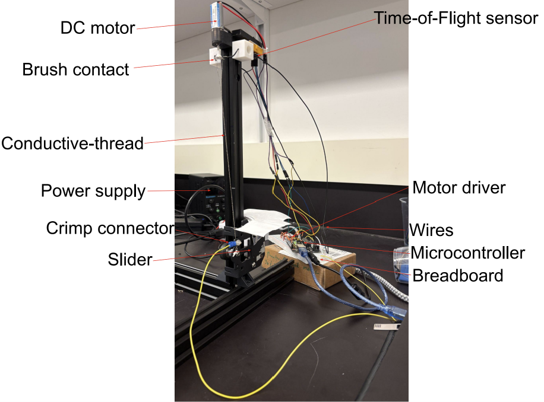

# Twisted String Actuator Test Apparatus
A mechatronics test platform designed to characterize the relationship between
actuator contraction and the electrical resistance of conductive thread in a
twisted string actuator (TSA).

The system combines mechanical actuation, position sensing, electrical
resistance measurement, embedded control, and automated data logging.

## Demonstration

**Click the image to view the demonstration video.**

## Project Overview

The system uses a DC motor to twist the string while an Arduino simultaneously
records actuator position and electrical resistance. The resulting data can be
used to investigate whether the conductive string itself can provide useful
position feedback for a soft/wearable robotic actuator.

## CAD Design

